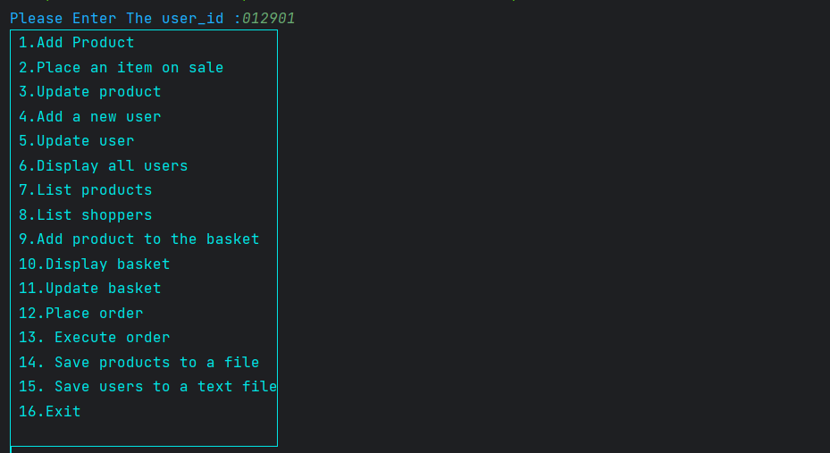
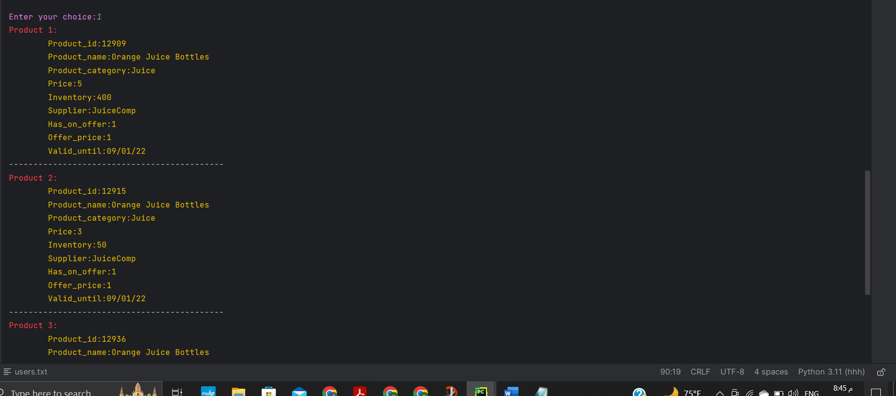

# Python project at LINUX LABORATORY-ENCS3130 in summer 2023 
___________________________________________________________

🔗 | [Project Description](./Python-Project-Summer-2023.pdf)   
# E-commerce-System

E-commerce encompasses utilizing digital platforms and computational utilities to facilitate business transactions and customer engagements online. 
The individual at the helm of this operation, the E-commerce Administrator, is responsible for overseeing and managing the online store's daily activities.
Meanwhile, the Shopper navigates through the online inventory, exploring and purchasing products from the virtual marketplace.
___________________________________________________________

##Menu

##SubMenu

##List All Products

##Place Item On Sale

##Update User

